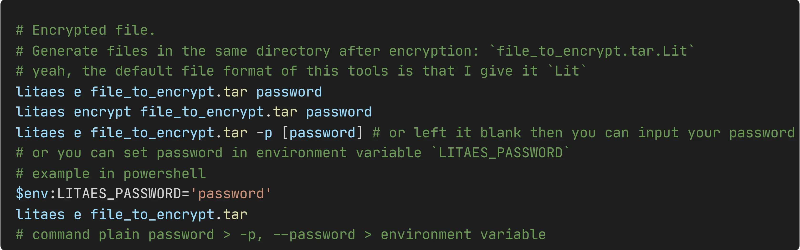
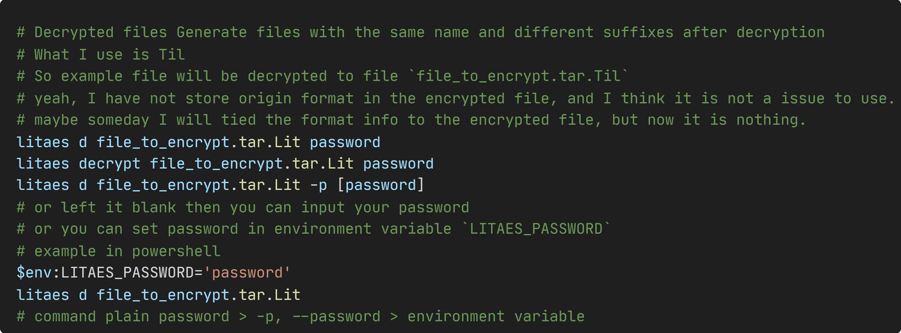

# LitAes

A cli tool to help encrypt and decrypt your data using aes-256.

# Install

```sh
npm i -g litaes
```

# Usage

## Encrypt file



## Decrypt file

This tool can only decrypt files encrypted by this tool.


